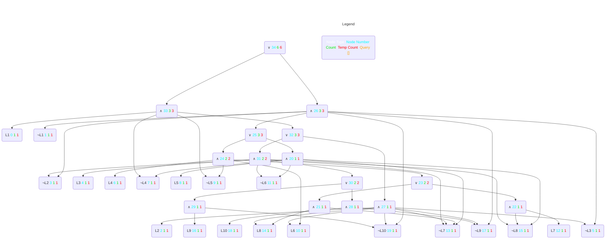

```mermaid
	graph TD
        subgraph pad1 [ ]
            subgraph pad2 [ ]
                subgraph legend[Legend]
                    nodes("<font color=white> Node Type <font color=cyan> Node Number <font color=greeny> Count <font color=red> Temp Count <font color=orange> Query []")
                    style legend fill:none, stroke:none
                end
                style pad2 fill:none, stroke:none
            end
            style pad1 fill:none, stroke:none
        end
        classDef marked stroke:#d90000, stroke-width:4px

		34("∨ <font color=cyan>34 <font color=greeny>6 <font color=red>6") --> 26 & 33;
		33("∧ <font color=cyan>33 <font color=greeny>3 <font color=red>3") --> 0 & 7 & 9 & 32;
		32("∨ <font color=cyan>32 <font color=greeny>3 <font color=red>3") --> 31 & 27;
		31("∧ <font color=cyan>31 <font color=greeny>2 <font color=red>2") --> 4 & 3 & 11 & 13 & 15 & 30;
		30("∨ <font color=cyan>30 <font color=greeny>2 <font color=red>2") --> 28 & 29;
		29("∧ <font color=cyan>29 <font color=greeny>1 <font color=red>1") --> 16 & 19;
		28("∧ <font color=cyan>28 <font color=greeny>1 <font color=red>1") --> 17 & 18;
		27("∧ <font color=cyan>27 <font color=greeny>1 <font color=red>1") --> 5 & 17 & 19 & 14 & 2 & 10 & 13;
		26("∧ <font color=cyan>26 <font color=greeny>3 <font color=red>3") --> 1 & 3 & 5 & 17 & 19 & 25;
		25("∨ <font color=cyan>25 <font color=greeny>3 <font color=red>3") --> 20 & 24;
		24("∧ <font color=cyan>24 <font color=greeny>2 <font color=red>2") --> 10 & 6 & 9 & 23;
		23("∨ <font color=cyan>23 <font color=greeny>2 <font color=red>2") --> 21 & 22;
		22("∧ <font color=cyan>22 <font color=greeny>1 <font color=red>1") --> 12 & 15;
		21("∧ <font color=cyan>21 <font color=greeny>1 <font color=red>1") --> 13 & 14;
		20("∧ <font color=cyan>20 <font color=greeny>1 <font color=red>1") --> 11 & 7 & 13 & 15 & 8;
		19("¬L10 <font color=cyan>19 <font color=greeny>1 <font color=red>1");
		18("L10 <font color=cyan>18 <font color=greeny>1 <font color=red>1");
		17("¬L9 <font color=cyan>17 <font color=greeny>1 <font color=red>1");
		16("L9 <font color=cyan>16 <font color=greeny>1 <font color=red>1");
		15("¬L8 <font color=cyan>15 <font color=greeny>1 <font color=red>1");
		14("L8 <font color=cyan>14 <font color=greeny>1 <font color=red>1");
		13("¬L7 <font color=cyan>13 <font color=greeny>1 <font color=red>1");
		12("L7 <font color=cyan>12 <font color=greeny>1 <font color=red>1");
		11("¬L6 <font color=cyan>11 <font color=greeny>1 <font color=red>1");
		10("L6 <font color=cyan>10 <font color=greeny>1 <font color=red>1");
		9("¬L5 <font color=cyan>9 <font color=greeny>1 <font color=red>1");
		8("L5 <font color=cyan>8 <font color=greeny>1 <font color=red>1");
		7("¬L4 <font color=cyan>7 <font color=greeny>1 <font color=red>1");
		6("L4 <font color=cyan>6 <font color=greeny>1 <font color=red>1");
		5("¬L3 <font color=cyan>5 <font color=greeny>1 <font color=red>1");
		4("L3 <font color=cyan>4 <font color=greeny>1 <font color=red>1");
		3("¬L2 <font color=cyan>3 <font color=greeny>1 <font color=red>1");
		2("L2 <font color=cyan>2 <font color=greeny>1 <font color=red>1");
		1("¬L1 <font color=cyan>1 <font color=greeny>1 <font color=red>1");
		0("L1 <font color=cyan>0 <font color=greeny>1 <font color=red>1");
```