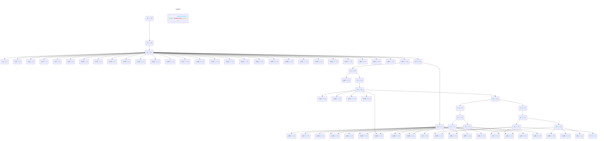

```mermaid
	graph TD
        subgraph pad1 [ ]
            subgraph pad2 [ ]
                subgraph legend[Legend]
                    nodes("<font color=white> Node Type <font color=cyan> Node Number <font color=greeny> Count <font color=red> Temp Count <font color=orange> Query []")
                    style legend fill:none, stroke:none
                end
                style pad2 fill:none, stroke:none
            end
            style pad1 fill:none, stroke:none
        end
        classDef marked stroke:#d90000, stroke-width:4px

		72("∧ <font color=cyan>72 <font color=greeny>5 <font color=red>5") --> 71;
		71("∨ <font color=cyan>71 <font color=greeny>5 <font color=red>5") --> 70;
		70("∧ <font color=cyan>70 <font color=greeny>5 <font color=red>5") --> 28 & 27 & 26 & 25 & 24 & 23 & 22 & 21 & 20 & 19 & 18 & 17 & 16 & 15 & 14 & 13 & 12 & 11 & 10 & 9 & 8 & 7 & 6 & 5 & 4 & 3 & 2 & 1 & 0 & 69;
		69("∨ <font color=cyan>69 <font color=greeny>5 <font color=red>5") --> 68 & 62;
		68("∧ <font color=cyan>68 <font color=greeny>1 <font color=red>1") --> 38 & 37 & 50 & 67 & 54 & 48 & 52 & 66 & 32 & 65 & 64 & 36 & 40 & 63;
		67("L35 <font color=cyan>67 <font color=greeny>1 <font color=red>1");
		66("L27 <font color=cyan>66 <font color=greeny>1 <font color=red>1");
		65("¬L19 <font color=cyan>65 <font color=greeny>1 <font color=red>1");
		64("L18 <font color=cyan>64 <font color=greeny>1 <font color=red>1");
		63("L6 <font color=cyan>63 <font color=greeny>1 <font color=red>1");
		62("∧ <font color=cyan>62 <font color=greeny>4 <font color=red>4") --> 29 & 61;
		61("∨ <font color=cyan>61 <font color=greeny>4 <font color=red>4") --> 60;
		60("∧ <font color=cyan>60 <font color=greeny>4 <font color=red>4") --> 34 & 33 & 32 & 31 & 30 & 59;
		59("∧ <font color=cyan>59 <font color=greeny>4 <font color=red>4") --> 58 & 46;
		58("∧ <font color=cyan>58 <font color=greeny>2 <font color=red>2") --> 57;
		57("∨ <font color=cyan>57 <font color=greeny>2 <font color=red>2") --> 56 & 51;
		56("∧ <font color=cyan>56 <font color=greeny>1 <font color=red>1") --> 55 & 54 & 53 & 52;
		55("L36 <font color=cyan>55 <font color=greeny>1 <font color=red>1");
		54("¬L33 <font color=cyan>54 <font color=greeny>1 <font color=red>1");
		53("L29 <font color=cyan>53 <font color=greeny>1 <font color=red>1");
		52("¬L28 <font color=cyan>52 <font color=greeny>1 <font color=red>1");
		51("∧ <font color=cyan>51 <font color=greeny>1 <font color=red>1") --> 50 & 49 & 48 & 47;
		50("¬L36 <font color=cyan>50 <font color=greeny>1 <font color=red>1");
		49("L33 <font color=cyan>49 <font color=greeny>1 <font color=red>1");
		48("¬L29 <font color=cyan>48 <font color=greeny>1 <font color=red>1");
		47("L28 <font color=cyan>47 <font color=greeny>1 <font color=red>1");
		46("∧ <font color=cyan>46 <font color=greeny>2 <font color=red>2") --> 45;
		45("∨ <font color=cyan>45 <font color=greeny>2 <font color=red>2") --> 44 & 39;
		44("∧ <font color=cyan>44 <font color=greeny>1 <font color=red>1") --> 43 & 42 & 41 & 40;
		43("L39 <font color=cyan>43 <font color=greeny>1 <font color=red>1");
		42("¬L38 <font color=cyan>42 <font color=greeny>1 <font color=red>1");
		41("L8 <font color=cyan>41 <font color=greeny>1 <font color=red>1");
		40("¬L7 <font color=cyan>40 <font color=greeny>1 <font color=red>1");
		39("∧ <font color=cyan>39 <font color=greeny>1 <font color=red>1") --> 38 & 37 & 36 & 35;
		38("¬L39 <font color=cyan>38 <font color=greeny>1 <font color=red>1");
		37("L38 <font color=cyan>37 <font color=greeny>1 <font color=red>1");
		36("¬L8 <font color=cyan>36 <font color=greeny>1 <font color=red>1");
		35("L7 <font color=cyan>35 <font color=greeny>1 <font color=red>1");
		34("¬L35 <font color=cyan>34 <font color=greeny>1 <font color=red>1");
		33("¬L27 <font color=cyan>33 <font color=greeny>1 <font color=red>1");
		32("¬L26 <font color=cyan>32 <font color=greeny>1 <font color=red>1");
		31("¬L18 <font color=cyan>31 <font color=greeny>1 <font color=red>1");
		30("¬L6 <font color=cyan>30 <font color=greeny>1 <font color=red>1");
		29("L19 <font color=cyan>29 <font color=greeny>1 <font color=red>1");
		28("L43 <font color=cyan>28 <font color=greeny>1 <font color=red>1");
		27("L42 <font color=cyan>27 <font color=greeny>1 <font color=red>1");
		26("L41 <font color=cyan>26 <font color=greeny>1 <font color=red>1");
		25("L40 <font color=cyan>25 <font color=greeny>1 <font color=red>1");
		24("¬L37 <font color=cyan>24 <font color=greeny>1 <font color=red>1");
		23("¬L34 <font color=cyan>23 <font color=greeny>1 <font color=red>1");
		22("¬L32 <font color=cyan>22 <font color=greeny>1 <font color=red>1");
		21("¬L31 <font color=cyan>21 <font color=greeny>1 <font color=red>1");
		20("¬L30 <font color=cyan>20 <font color=greeny>1 <font color=red>1");
		19("¬L25 <font color=cyan>19 <font color=greeny>1 <font color=red>1");
		18("¬L24 <font color=cyan>18 <font color=greeny>1 <font color=red>1");
		17("¬L23 <font color=cyan>17 <font color=greeny>1 <font color=red>1");
		16("¬L22 <font color=cyan>16 <font color=greeny>1 <font color=red>1");
		15("¬L21 <font color=cyan>15 <font color=greeny>1 <font color=red>1");
		14("¬L20 <font color=cyan>14 <font color=greeny>1 <font color=red>1");
		13("¬L17 <font color=cyan>13 <font color=greeny>1 <font color=red>1");
		12("¬L16 <font color=cyan>12 <font color=greeny>1 <font color=red>1");
		11("¬L15 <font color=cyan>11 <font color=greeny>1 <font color=red>1");
		10("¬L14 <font color=cyan>10 <font color=greeny>1 <font color=red>1");
		9("¬L13 <font color=cyan>9 <font color=greeny>1 <font color=red>1");
		8("¬L12 <font color=cyan>8 <font color=greeny>1 <font color=red>1");
		7("¬L11 <font color=cyan>7 <font color=greeny>1 <font color=red>1");
		6("¬L10 <font color=cyan>6 <font color=greeny>1 <font color=red>1");
		5("¬L9 <font color=cyan>5 <font color=greeny>1 <font color=red>1");
		4("¬L5 <font color=cyan>4 <font color=greeny>1 <font color=red>1");
		3("¬L4 <font color=cyan>3 <font color=greeny>1 <font color=red>1");
		2("¬L3 <font color=cyan>2 <font color=greeny>1 <font color=red>1");
		1("¬L2 <font color=cyan>1 <font color=greeny>1 <font color=red>1");
		0("L1 <font color=cyan>0 <font color=greeny>1 <font color=red>1");
```